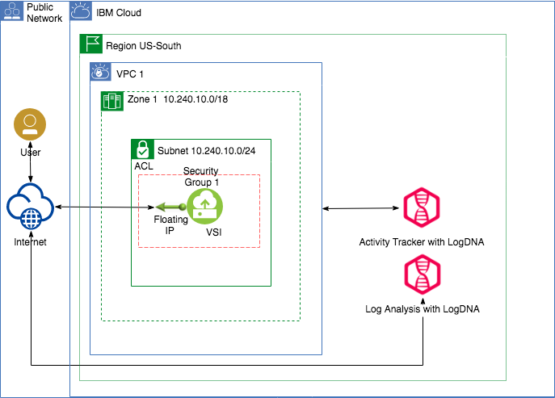
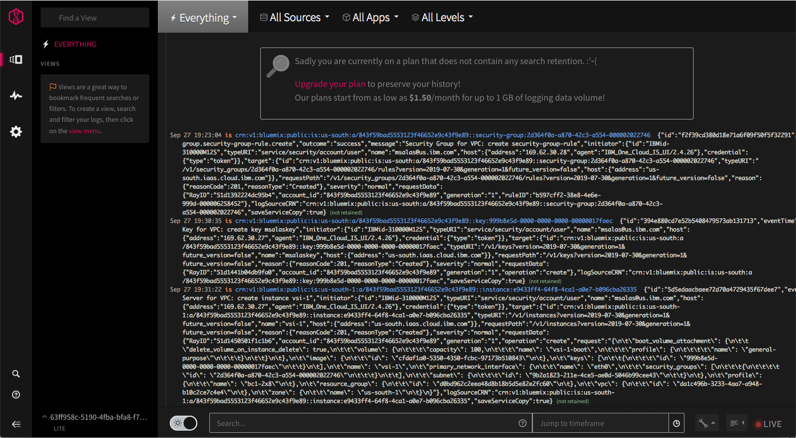
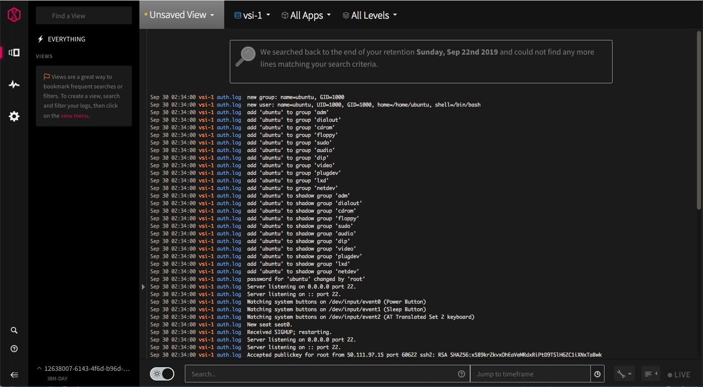

# Use GUI, CLI or API to deploy a VPC, track acitivities through IBM Activity Tracker with LogDNA and generate logs for IBM Log Analysis with LogDNA.

### Purpose
This scenario will use two [IBM Cloud Observability](https://cloud.ibm.com/observe) offerings through LogDNA. First, to verify VPC integration with [IBM Cloud Activity Tracker with LogDNA](https://cloud.ibm.com/docs/services/Activity-Tracker-with-LogDNA?topic=logdnaat-getting-started#getting-started) which records user-initiated activities. Second, use a VPC Virtual Server Instance (VSI) to generate log entries for [IBM Log Analysis with LogDNA](https://cloud.ibm.com/docs/services/Log-Analysis-with-LogDNA?topic=LogDNA-getting-started#getting-started)

### Architecture



### Prerequisites
1. An IBM Cloud Account
2. Authority to create VPC resources, Actity Tracker, and Log Analysis for LogDNA services in the IBM Cloud Account
3. ssh-keygen installed locally.

### Assumptions
1. You have basic knowledge of the linux cURL and VI editor

## Creating LogDNA services

Before deploying a VPC, we need to create an instance of each service. Activity Tracker logs activities done in the VPC so this service is needed before executing the VPC setup. Log Analysis is used to create log entries of applications or system logs from machines. Refer to the links at bottom for more information.

### Create an instance of IBM Cloud Activity Tracker with LogDNA

1. Login to [IBM Cloud](https://cloud.ibm.com/login)
2. Select [Observability](https://cloud.ibm.com/observe)
3. Select `Activity Tracker`, then click `Create activity tracker instance`.
4. Provide a name for the new service instance, select target `Region` and `Resource Group`.

**Notes:**
- If you are not able to select a resource group, check that you have editing permissions on the resource group where you want to provision the instance.
- The system proposes the `default` resource group of the account. If you wish to use a different group, please refer to [these instructions](https://cloud.ibm.com/docs/resources?topic=resources-rgs#creating-a-resource-group).

4. Select a `Pricing Plan`. By default, the Lite plan is selected but this plan will not save any of the activities (display only).
5. Click Create.
6. After you provision an instance, the Activity Tracker will be listed. You can launch the dashboard by selecting the `View LogDNA` link.

### Create an instance of IBM Cloud Activity Tracker with LogDNA

1. Login to [IBM Cloud](https://cloud.ibm.com/login)
2. Select [Observability](https://cloud.ibm.com/observe)
3. Select `Logging`, then click `Create logging instance`.
4. Provide a name for the new service instance, select target `Region` and `Resource Group`.

**Notes:**
- If you are not able to select a resource group, check that you have editing permissions on the resource group where you want to provision the instance.
- The system proposes the `default` resource group of the account. If you wish to use a different group, please refer to [these instructions](https://cloud.ibm.com/docs/resources?topic=resources-rgs#creating-a-resource-group).

4. Select a `Pricing Plan`. By default, the Lite plan is selected but this plan will not save any of the logs (display only).
5. Click Create.
6. After you provision an instance, the Log Analysis will be listed. You can launch the dashboard by selecting the `View LogDNA` link.

## Creating a Virtual Private Cloud.
First we must create a Virtual Private Cloud (VPC) and a Virtual Server in the VPC that the `AppMonitor` sample application will execute in. The instructions to deploy the VPC infrastructure for this scenario are available in these flavors:
1. [Using the IBM Cloud CLI](CLI.md)
2. [Using the IBM Console UI](UI.md)
3. [Using the IBM Cloud API](API.md)

## Verify activities logged in Activity Tracker.

During the creation of the VPC and VPC elements (Subnet, VSI, etc.) these activities were sent to your Activiy Tracker. Below is an example of an activity log:



For more information on the event structure and information, please refer to [View Events](https://cloud.ibm.com/docs/services/Activity-Tracker-with-LogDNA?topic=logdnaat-getting-started#gs_step5)

## Generate logs from the VPC VSI.

Now that the VPC has been created with a Virtual Server Instance, it is time to install a LogDNA agent to capture information and send log data to your instance of IBM Log Analysis with LogDNA.

1. Issue the following command to access the Virtual Server from your workstation: 
   
    - `ssh root@*floating ip*`  
       The *floating ip* is the IP address assigned to the VPC's VSI in the previous section.

   If you need to specify the SSH Key file, use the following command:

    - `ssh -i *ssh key file* root@*floating ip*`
       The *ssh key file* is the full path and filename of the SSH Key file created with your VPC.

2. Install the LogDNA agent by issuing the following commands:
```
echo "deb https://repo.logdna.com stable main" | sudo tee /etc/apt/sources.list.d/logdna.list
wget -O- https://repo.logdna.com/logdna.gpg | sudo apt-key add -
sudo apt-get update
sudo apt-get install logdna-agent < "/dev/null"
```

3. Set the ingestion key that the LogDNA agent must use to forward logs to the IBM Log Analysis with LogDNA instance. (You can obtain the Ingestion Key from the Observability dashboard by selecting View Key on the three vertical dots next to your instance)
```
 sudo logdna-agent -k INGESTION_KEY
```
replace INGESTION_KEY with your key.

4. Set the authentication endpoint. The LogDNA agent uses this endpoint to authenticate and get the token to forward logs.
```
sudo logdna-agent -s LOGDNA_APIHOST=api.us-south.logging.cloud.ibm.com
```
5. Set the ingestion endpoint.
```
sudo logdna-agent -s LOGDNA_LOGHOST=logs.us-south.logging.cloud.ibm.com
```
5. By default, the LogDNA agent monitors `/var/log`. If you wish todDefine more log paths to be monitored. use the following command and provide the specific path:
```
sudo logdna-agent -d /path/to/log/folders
```
6. Run the agent:
```
sudo update-rc.d logdna-agent defaults
sudo /etc/init.d/logdna-agent start
```
7. View the logs for your VSI (`vsi-1`) in Logs for LogDNA dashboard. Below is an example



for more information refer to [Viewing Logs](https://cloud.ibm.com/docs/services/Log-Analysis-with-LogDNA?topic=LogDNA-view_logs#view_logs)

Links 
- [Track Your Cloud Activities](https://www.ibm.com/cloud/blog/track-your-cloud-activities-using-ibm-cloud-activity-tracker-with-logdna)
- [IBM Cloud Activity Tracker with LogDNA](https://cloud.ibm.com/docs/services/Activity-Tracker-with-LogDNA?topic=logdnaat-getting-started)
- [What is Log Analysis?](https://www.ibm.com/cloud/log-analysis)
- [IBM Log Analysis with LogDNA](https://cloud.ibm.com/docs/services/Log-Analysis-with-LogDNA?topic=LogDNA-getting-started)


* Note the Cloud Service in this case is the VPC service

### Prerequisites

1. Install the [IBM Cloud CLI](https://console.bluemix.net/docs/cli/reference/bluemix_cli/get_started.html#getting-started)
2. Install the infrastructure-service plugin.  
   `$ ibmcloud plugin install infrastructure-service`
3. Install the activity-tracker  plugin
   `$ ibmcloud plugin install activity-tracker -r Bluemix`
4. Provision an Activity Tracker instance.  Details found [here]((https://cloud.ibm.com/docs/services/cloud-activity-tracker/how-to/provision.html#provision)

* Note: Only the account owner will be able to see events via the CLI

### Deploy Scenarios

1. [Command Line Interface (CLI)](CLI.md)
2. [User Interface (UI)](UI.md)
3. [API](API.md)

* Note: The UI for the Activity Tracker had troubles loading during testing but you can see events via the UI at https://logging.ng.bluemix.net
